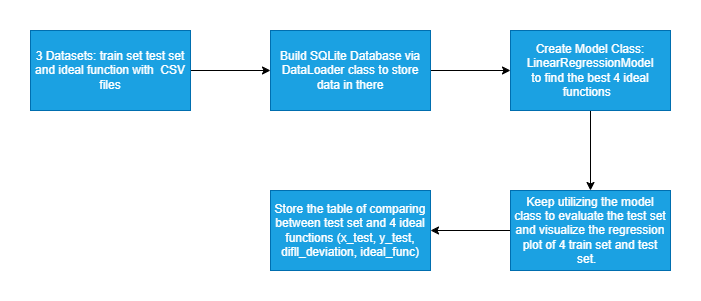
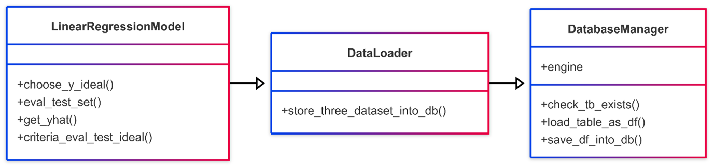
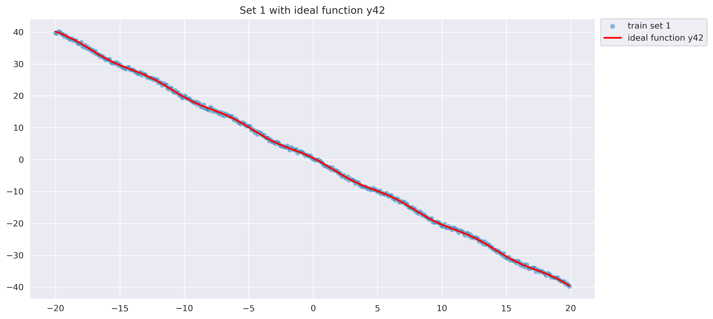
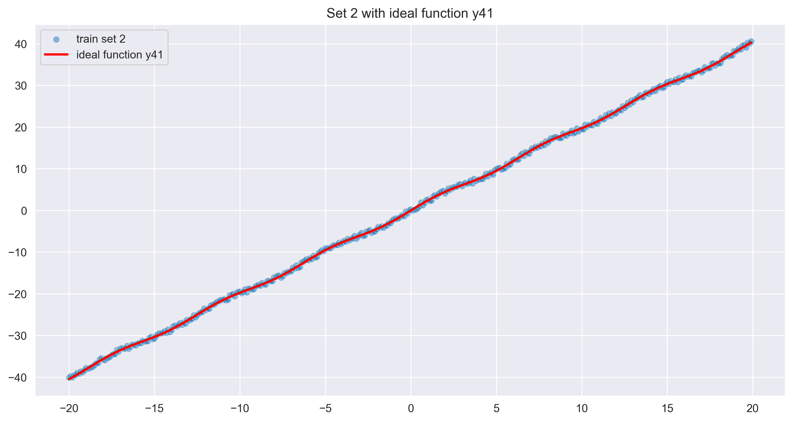
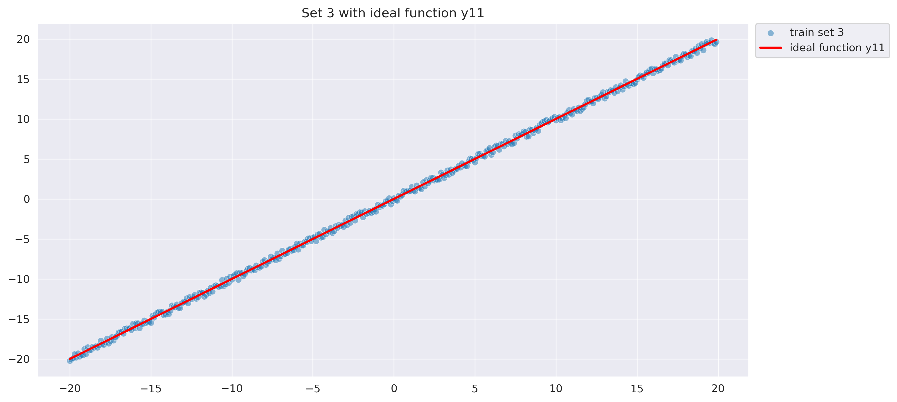
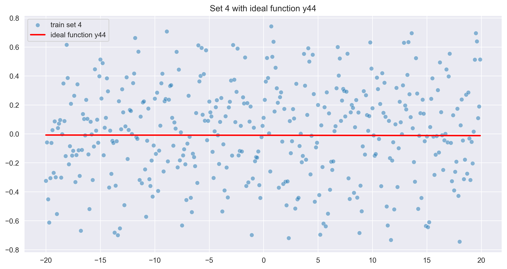
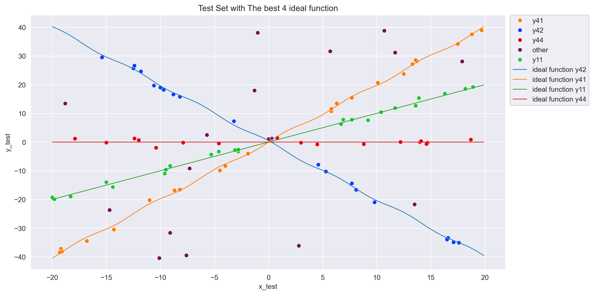

# 📘 Project Introduction: Linear Regression Evaluation Pipeline

---

## 🔍 A. Overview
This project implements an end-to-end data workflow involving the use of:

- **Pandas** and **SQLAlchemy** for data handling and storage in an SQLite database
- **Linear Regression** for matching training data to ideal functions
- **Evaluation formula** to assign test data based on deviation constraints
- **Visualizations** and **unit tests** for validating both test and training sets

---

## 🧱 B. Project Architecture

According to the task requirements, the project is designed as a modular, step-by-step pipeline that transforms raw CSV files into meaningful regression-based evaluation and stores results in a relational database.

The following workflow diagram guides the implementation:



```text
CSV Files → DataLoader → SQLite DB → LinearRegressionModel → Evaluation → Result Storage
```

---

## 🧩 C. Class Design

- `DatabaseManager`: handles connection, table checks, and data persistence
- `DataLoader`: extends `DatabaseManager` and is responsible for loading and storing training, test, and ideal datasets
- `LinearRegressionModel`: performs slope/intercept calculations, ideal function matching, and evaluation logic


---

## 🔄 D. Workflow Breakdown

### 1. Load CSVs to SQLite (DataLoader)
- Loads Training, Test, and Ideal CSVs into SQLite
- Creates the tables:
  - `training_tb`
  - `test_tb`
  - `ideal_tb`

### 2. Linear Regression Model
- Calculates the slope and intercept of each training set
- Reflects each into the 50 ideal functions using the least-squares method
- Chooses the best match for each training set by minimizing the sum of squared y-deviations
- Determines `max_deviation` for use in test set evaluation

### 3. Test Point Evaluation
- For each test point `(x, y)`:
  - Compares it against the 4 best-fit ideal functions at `x`
  - Accepts a match if:
    ```
    |y_test - y_ideal| ≤ √2 × max_deviation
    ```
  - Stores result in table `eval_test_tb` with columns:
    - `x_test`, `y_test`, `ideal_func`, `diff_deviation`

### 4. Store Best 4 Ideal Functions
- The chosen best 4 functions are stored in the table `four_best_ideal_tb`

---

## ✅ E. Unit Testing
All test files are stored in the `Code/unit_test/` directory. Both test modules are built using supper class `unittest.TestCase`:

### 📄 `test_dataloader.py`
- Tests for:
  - Storing datasets
  - Verifying table existence
  - Loading and saving tables
  - Raising exceptions for invalid or missing tables

### 📄 `test_model.py`
- Functional tests for:
  - Regression logic
  - Slope/intercept computation
  - ŷ prediction accuracy
  - Deviation evaluation logic
- Verifies criteria-based matching of test samples
- Outputs are printed for clarity

---

## 📊 F. Visualization

Visualizations are generated to show the relationship between:
- Each of the 4 training functions and their corresponding best-fit ideal functions




Additional visualizations include:
- Test set distribution across the 4 best ideal functions
- Highlighting and excluding unmatched test points for better clarity

---

## 🔀 G. Merge Request Workflow

To integrate contributions into the shared develop branch, follow the Git-based collaboration workflow:

📦 Steps:

1. Clone the project and checkout the develop branch 
2. Create a new branch for your feature
3. Stage, commit, and push your changes
4. Open a Pull Request on GitHub:
   - Target branch: `dev_branch` 
   - Add a meaningful title and description 
   - Request review from teammates

5. Once approved, the feature is merged into `dev_branch`

>📎 For a detailed command reference, see attached file: [GIT_WORKFLOW.md](GIT_WORKFLOW.md)

## ✅ Conclusion

This pipeline demonstrates a modular, object-oriented approach to machine learning evaluation via classic regression. It showcases:
- Clean separation of concerns
- End-to-end traceability of data
- Realistic evaluation metrics
- Academic-grade reproducibility

By incorporating solid testing, storage, and visualization strategies, the project aligns with best practices in both industry and educational settings.

